```python
import pandas as pd
import numpy as np
import seaborn as sns
import matplotlib.pyplot as plt
```


```python
import warnings
warnings.simplefilter(action='ignore', category=FutureWarning)
warnings.simplefilter(action='ignore', category=DeprecationWarning)
```

# Predicting Credit Default.
#### Identifying risky credit patterns

We'll be analysing credit card data, collected in Taiwan (link below). Trying to predict patterns that lead to defaulting on credit. Various Machine Learning methods will be applied to the dataset. We will also try to derive some features to help our predictions. The 'real world' applications of these methods will be considered throughout our report. Balancing performance with predictive power will be a consideration throughout the report. 

https://archive.ics.uci.edu/ml/datasets/default+of+credit+card+clients

### Definitions:
**Default:** After you’ve failed to make a payment on your credit card for 180 days, your issuer assumes you’re probably never going to. At this point, the issuer can (and usually does) close your card, write off what you owe as bad debt and sell your account to a collections agency.


```python
df = pd.read_csv("https://raw.githubusercontent.com/CruddyShad0w/CST-463-Project1/master/default_cc_train.csv",sep=',')
df.head()
```


<div>
<style scoped>
    .dataframe tbody tr th:only-of-type {
        vertical-align: middle;
    }

    .dataframe tbody tr th {
        vertical-align: top;
    }

    .dataframe thead th {
        text-align: right;
    }
</style>
<table border="1" class="dataframe">
  <thead>
    <tr style="text-align: right;">
      <th></th>
      <th>ID</th>
      <th>LIMIT_BAL</th>
      <th>SEX</th>
      <th>EDUCATION</th>
      <th>MARRIAGE</th>
      <th>AGE</th>
      <th>PAY_0</th>
      <th>PAY_2</th>
      <th>PAY_3</th>
      <th>PAY_4</th>
      <th>...</th>
      <th>BILL_AMT4</th>
      <th>BILL_AMT5</th>
      <th>BILL_AMT6</th>
      <th>PAY_AMT1</th>
      <th>PAY_AMT2</th>
      <th>PAY_AMT3</th>
      <th>PAY_AMT4</th>
      <th>PAY_AMT5</th>
      <th>PAY_AMT6</th>
      <th>default.payment.next.month</th>
    </tr>
  </thead>
  <tbody>
    <tr>
      <th>0</th>
      <td>8811</td>
      <td>390000</td>
      <td>2</td>
      <td>1</td>
      <td>1</td>
      <td>64</td>
      <td>1</td>
      <td>-2</td>
      <td>-2</td>
      <td>-2</td>
      <td>...</td>
      <td>0</td>
      <td>0</td>
      <td>8668</td>
      <td>0</td>
      <td>0</td>
      <td>0</td>
      <td>0</td>
      <td>8668</td>
      <td>4490</td>
      <td>1</td>
    </tr>
    <tr>
      <th>1</th>
      <td>23496</td>
      <td>60000</td>
      <td>2</td>
      <td>2</td>
      <td>2</td>
      <td>31</td>
      <td>0</td>
      <td>0</td>
      <td>0</td>
      <td>2</td>
      <td>...</td>
      <td>42057</td>
      <td>26877</td>
      <td>26493</td>
      <td>4100</td>
      <td>4073</td>
      <td>0</td>
      <td>1600</td>
      <td>0</td>
      <td>1100</td>
      <td>1</td>
    </tr>
    <tr>
      <th>2</th>
      <td>1164</td>
      <td>210000</td>
      <td>2</td>
      <td>2</td>
      <td>1</td>
      <td>39</td>
      <td>0</td>
      <td>0</td>
      <td>0</td>
      <td>0</td>
      <td>...</td>
      <td>19850</td>
      <td>15530</td>
      <td>13021</td>
      <td>14000</td>
      <td>3007</td>
      <td>5000</td>
      <td>1000</td>
      <td>13021</td>
      <td>22171</td>
      <td>0</td>
    </tr>
    <tr>
      <th>3</th>
      <td>19421</td>
      <td>500000</td>
      <td>2</td>
      <td>1</td>
      <td>1</td>
      <td>35</td>
      <td>-2</td>
      <td>-1</td>
      <td>0</td>
      <td>-1</td>
      <td>...</td>
      <td>7896</td>
      <td>8970</td>
      <td>215305</td>
      <td>36277</td>
      <td>6112</td>
      <td>10014</td>
      <td>9018</td>
      <td>215518</td>
      <td>20018</td>
      <td>0</td>
    </tr>
    <tr>
      <th>4</th>
      <td>16890</td>
      <td>150000</td>
      <td>1</td>
      <td>1</td>
      <td>2</td>
      <td>37</td>
      <td>2</td>
      <td>2</td>
      <td>2</td>
      <td>2</td>
      <td>...</td>
      <td>38687</td>
      <td>37765</td>
      <td>40352</td>
      <td>1600</td>
      <td>0</td>
      <td>3300</td>
      <td>0</td>
      <td>3200</td>
      <td>1700</td>
      <td>1</td>
    </tr>
  </tbody>
</table>
<p>5 rows × 25 columns</p>
</div>


```python
corr = df.corr()
mask = np.zeros_like(corr,dtype=np.bool)
f, ax = plt.subplots(figsize=(11,9))
cmap = sns.diverging_palette(220,10,as_cmap=True)
sns.heatmap(corr,mask=mask,cmap=cmap,vmax=.3,center=0,square=True,linewidths=.5,cbar_kws={"shrink":.5})
plt.title('Correlation of features')
```


    Text(0.5, 1.0, 'Correlation of features')


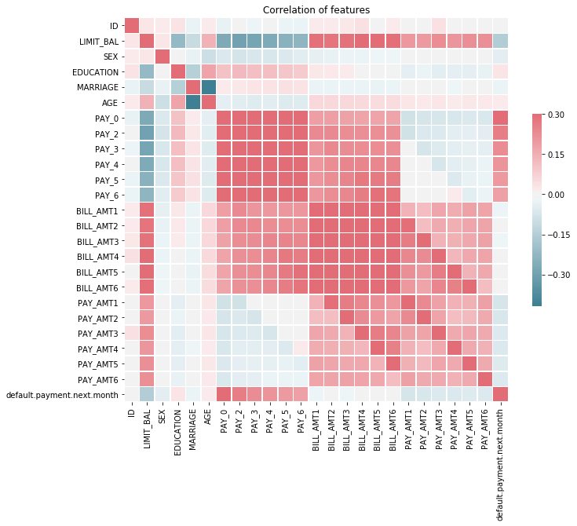


```python
df.info()
print("Shape: ",df.shape)
```

    <class 'pandas.core.frame.DataFrame'>
    RangeIndex: 25000 entries, 0 to 24999
    Data columns (total 25 columns):
    ID                            25000 non-null int64
    LIMIT_BAL                     25000 non-null int64
    SEX                           25000 non-null int64
    EDUCATION                     25000 non-null int64
    MARRIAGE                      25000 non-null int64
    AGE                           25000 non-null int64
    PAY_0                         25000 non-null int64
    PAY_2                         25000 non-null int64
    PAY_3                         25000 non-null int64
    PAY_4                         25000 non-null int64
    PAY_5                         25000 non-null int64
    PAY_6                         25000 non-null int64
    BILL_AMT1                     25000 non-null int64
    BILL_AMT2                     25000 non-null int64
    BILL_AMT3                     25000 non-null int64
    BILL_AMT4                     25000 non-null int64
    BILL_AMT5                     25000 non-null int64
    BILL_AMT6                     25000 non-null int64
    PAY_AMT1                      25000 non-null int64
    PAY_AMT2                      25000 non-null int64
    PAY_AMT3                      25000 non-null int64
    PAY_AMT4                      25000 non-null int64
    PAY_AMT5                      25000 non-null int64
    PAY_AMT6                      25000 non-null int64
    default.payment.next.month    25000 non-null int64
    dtypes: int64(25)
    memory usage: 4.8 MB
    Shape:  (25000, 25)


Looks like its a full 25000 rows with no null values. Does not look like any data cleaning will be needed only scaling and preprocessing.


```python
sns.countplot(df['default.payment.next.month'])
plt.title('Histogram of payment defaults')
plt.xticks((0,1),('Default','Good Standing'))
plt.xlabel('Default payments')
```


    Text(0.5, 0, 'Default payments')


```python
print( 'Percentage of default: '+ str(100*len(df[df['default.payment.next.month'] ==1]) / len(df) ))
```

    Percentage of default: 22.056


About one in every 3.5-4 people will end up defaulting. 


```python
sns.distplot(df['AGE'])
```


    <matplotlib.axes._subplots.AxesSubplot at 0x7f4e0aa13860>


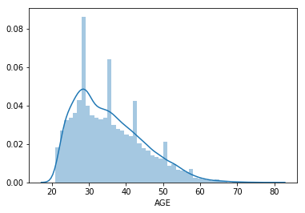


Interesting distribution here, large concentrations around 28, 35, 43, and 52


```python
sns.countplot('EDUCATION',hue='default.payment.next.month',data=df)
plt.title('Educational Distribution')
plt.xlabel('Maximum Level of Education')
L = plt.legend(title='Default')
L.get_texts()[0].set_text('No')
L.get_texts()[1].set_text('Yes')
plt.xticks((0,1,2,3,4,5,6),('<12 grade','graduate school','university','high school','other','trade school','Not disclosed'),rotation=45)
```


    ([<matplotlib.axis.XTick at 0x7f4e0a1bb320>,
      <matplotlib.axis.XTick at 0x7f4e0a1a9c18>,
      <matplotlib.axis.XTick at 0x7f4e0a1a9a90>,
      <matplotlib.axis.XTick at 0x7f4e0a16b128>,
      <matplotlib.axis.XTick at 0x7f4e0a16b588>,
      <matplotlib.axis.XTick at 0x7f4e0a16ba58>,
      <matplotlib.axis.XTick at 0x7f4e0a16bf60>],
     <a list of 7 Text xticklabel objects>)


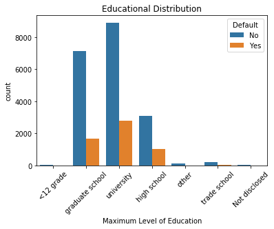


Our debtors are mostly educated people. There appears to be no significance in the relationship between education and defaulting on your credit card. 


```python
#mar_map = {0:'Not Provided',1:'Married',2:'Single',3:'Unknown'}
#mar_status = [mar_map[stat] for stat in df['MARRIAGE']]
sns.countplot('MARRIAGE', hue='default.payment.next.month',data=df)
plt.xticks((0,1,2,3),('Not Provided','Married','Single','Unknown'),rotation=45)
L = plt.legend(title='Default')
L.get_texts()[0].set_text('No')
L.get_texts()[1].set_text('Yes')
plt.title('Relationship Status')
```


    Text(0.5, 1.0, 'Relationship Status')


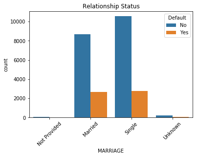


A greater percentage of married people end up defaulting on their debt. One would suspect otherwise, with the additional responsibility and future planning that usually comes with marriage. But perhaps single people have fewer financial burdens, like children, and are less likely to overextend themselves financially. 


```python
plot = sns.countplot(df['LIMIT_BAL'],hue = df['default.payment.next.month'])
plot.set_xticks(plot.get_xticks()[::5])
plot = plt.xticks(rotation=90)
plt.title('Histogram of Credit Limit Balances')
L = plt.legend(title='Default')
L.get_texts()[0].set_text('No')
L.get_texts()[1].set_text('Yes')
```


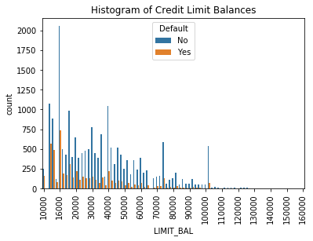


Kind of a hard figure to see but shows the reationship between a persons balance limit and thier defualt. Generally a higher percentage of people with lower limit balances will end up defaulting. If you're a 'high risk' applicant the bank usually will only approve you for a smaller line of credit. This graph might help show why that is. 


```python
default_labs = {0:'Good Standing',1:'Default'}
default = [default_labs[x] for x in df['default.payment.next.month']]
sns.violinplot(x=default, y='LIMIT_BAL',data=df)
plt.title("Limit Balance and default distribution")
```


    Text(0.5, 1.0, 'Limit Balance and default distribution')


Perhaps not very surprisingly, people with higher limit balances are less likely to to be defaulting. The defaulters had a lower average credit limit. Likely they already had a lower credit score to begin with. 


```python
sns.violinplot('default.payment.next.month', y='AGE',data=df)
plt.title('Default behavior by age distribution')
plt.xticks((0,1),('Default','Good Standing'))
plt.xlabel('')
```


    Text(0.5, 0, '')


Almost no difference at all in age distributions between defaulters and not. A little surprising actually. One would imagine younger people defaulting more. 

#### Bill amounts
According to the correlation plot above, the most significant features for predicting default payments will be the BILL_AMT fields. Let's visualize a couple to see what we can infer from them


```python
sns.distplot(df['BILL_AMT1'])
plt.title('Distribution of Bill Amounts in month 1')
plt.xlabel('Money Owed')
```


    Text(0.5, 0, 'Money Owed')


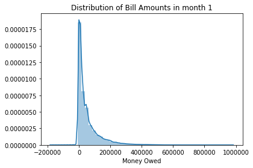


A very steep distirbution toward the lowerd end of money owed. Is this the general pattern this data will follow? Lets look at another month to be sure.


```python
sns.distplot(df['BILL_AMT6'])
plt.title('Distribution of Bill Amounts in month 6')
plt.xlabel('Money Owed')
plt.xlim((-50000,600000))
```


    (-50000, 600000)


Almost exactly the same. This seems to make sense. Most people won't want ot have too much debt. The vast majority of people have debt below about 50,000 (not sure if this is measured in Dollars or Yen. 


```python
sns.countplot(x='PAY_2', hue = 'default.payment.next.month' , data = df)
plt.title('Defaults by payment status')
plt.xlabel('Payment Status')
```


    Text(0.5, 0, 'Payment Status')


Not everyone that pays on time, or is paid up in a given month is guaranteed not to default. But for the folks that are already a few months late, it looks like you're more likely to end up in default than you are to end up paying off your debt. As we saw earlier in the correlation plot, payment status will be a very strong predictor of default.

### Derived Features: 
#### To add or not to add?
Our team played with a few strategies to sythesize some more features. Some features tested were: ratio of money owed to total balance, sum off amounts owed across each month, as well as a couple others trying to get something more meaningful out of the 'limit balance', 'pay amount' and 'bill amount'. Below is some featur engineering we've done, and through this we've managed to bump our average predictions up a couple %. No revolutionary gains, but something is better than nothing. 


```python
"""
Transformer class for the
    [default of credit card clients]
    (https://archive.ics.uci.edu/ml/datasets/default+of+credit+card+clients)
Data Set.

Usage:
    import preprocessing
    transformer = preprocessing.Transformer()
    X_train = transformer.fit_transform(df_train)
    X_test = transformer.transform(df_test)
"""
import numpy as np
import pandas as pd
from sklearn.base import TransformerMixin
from sklearn.pipeline import Pipeline, FeatureUnion
from sklearn.preprocessing import StandardScaler, OneHotEncoder


def _get_cols(prefix, from_idx, to_idx):
    res = []
    for i in range(from_idx, to_idx + 1):
        res.append(prefix + str(i))
    return res


class FeatureEngineer(TransformerMixin):
    """
    A Transformer for Feature Enginnering
    """
    PAY_AMTS = _get_cols('PAY_AMT', 1, 6)
    BILL_AMTS = _get_cols('BILL_AMT', 1, 6)
    PAYS = ['PAY_0'] + _get_cols('PAY_', 2, 6)

    def fit(self, dataframe):
        """
        :type dataframe pandas.DataFrame
        """
        return self

    def transform(self, dataframe):
        """
        :type dataframe pandas.DataFrame
        """
        dataframe['TOT_PAY_AMT'] = self._tot_pay_amt(dataframe)
        dataframe['TOT_BILL_AMT'] = self._tot_bill_amt(dataframe)
        dataframe['TOT_MOD'] = self._tot_month_of_delays(dataframe)
        dataframe['NUM_NO_COMSP'] = self._num_of_no_consumption(dataframe)
        dataframe['NUM_NO_DLY'] = self._num_of_no_delay(dataframe)
        return dataframe

    def _tot_pay_amt(self, dataframe):
        return dataframe[self.PAY_AMTS].sum(axis=1)

    def _tot_bill_amt(self, dataframe):
        return dataframe[self.BILL_AMTS].sum(axis=1)

    def _tot_month_of_delays(self, dataframe):
        return dataframe[self.PAYS].replace([-2, -1], 0).sum(axis=1)

    def _num_of_no_consumption(self, dataframe):
        return (dataframe[self.PAYS] == -2).sum(axis=1)

    def _num_of_no_delay(self, dataframe):
        return (dataframe[self.PAYS] == -1).sum(axis=1)


class NumFeatureSelector(TransformerMixin):
    """
    Select Numeric Features
    """
    FEATURES_ = [
        'LIMIT_BAL', 'AGE', 'TOT_PAY_AMT', 'TOT_BILL_AMT', 'TOT_MOD',
        'BILL_AMT1', 'BILL_AMT2', 'BILL_AMT3', 'BILL_AMT4', 'BILL_AMT5',
        'BILL_AMT6', 'PAY_AMT1', 'PAY_AMT2', 'PAY_AMT3', 'PAY_AMT4',
        'PAY_AMT5', 'PAY_AMT6'
    ]

    def __init__(self, features):
        super().__init__()
        self.features = features

    def fit(self, dataframe):
        """
        :type dataframe pandas.DataFrame
        """
        return self

    def transform(self, dataframe):
        """
        :type dataframe pandas.DataFrame
        """
        return dataframe[self.features].values


class CatFeatureSelector(TransformerMixin):
    """
    Select Categorical Features
    """
    FEATURES_ = [
        'SEX', 'EDUCATION', 'MARRIAGE', 'PAY_0',
        'PAY_2', 'PAY_3', 'PAY_4', 'PAY_5', 'PAY_6',
        'NUM_NO_COMSP', 'NUM_NO_DLY'
    ]

    def __init__(self, features=None):
        super().__init__()
        self._encoder = None
        if features is None:
            features = self.CAT_FEATURES_
        self.features = features

    def fit(self, dataframe):
        """
        :type dataframe pandas.DataFrame
        """
        self._encoder = OneHotEncoder(handle_unknown='ignore')
        X = dataframe[self.features].astype('int32')
        X -= X.min().min()
        self._encoder.fit(X)
        return self

    def transform(self, dataframe):
        """
        :type dataframe pandas.DataFrame
        """
        X = dataframe[self.features].astype('int32')
        X -= X.min().min()
        return self._encoder.transform(X).toarray()

    def feature_indices(self):
        return self._encoder.feature_indices_


class Transformer(TransformerMixin):
    """
    Transform the `default of credit card clients` data
    """
    _feature_enginner = FeatureEngineer()

    def __init__(self, num_features=None, cat_features=None):
        super().__init__()
        self._need_to_fit = True
        self._pipe = None
        self.df = None
        self.cat_selector = None
        if num_features is None:
            num_features = NumFeatureSelector.FEATURES_
        if cat_features is None:
            cat_features = CatFeatureSelector.FEATURES_
        self.num_features = num_features
        self.cat_features = cat_features

    def fit(self, dataframe):
        """
        :type dataframe pandas.DataFrame
        """
        self._need_to_fit = True
        return self

    def transform(self, dataframe):
        """
        :type dataframe pandas.DataFrame
        """
        self.df = self._feature_enginner.fit_transform(dataframe)
        if self._need_to_fit:
            self._need_to_fit = False
            self.cat_selector = CatFeatureSelector(self.cat_features)
            self._pipe = Pipeline([
                ('Feature Union', FeatureUnion([
                    ('Numeric Features', NumFeatureSelector(self.num_features)),
                    ('Encoded Categorical Features', self.cat_selector),
                ])),
                ('Standard Scaler', StandardScaler()),
            ])
            return self._pipe.fit_transform(self.df)
        return self._pipe.transform(self.df)

    def feature_importances(self, importances):
        """
        :type importances numpy.ndarray
        """
        indices = self.cat_selector.feature_indices()
        col = len(self.num_features)
        cat_scores = np.zeros(len(self.cat_features))
        for i in range(1, len(indices)):
            cat_scores[i - 1] = np.sum(importances[
                (col + indices[i - 1]):(col + indices[i])
            ])
        return pd.DataFrame({
            'feature': self.num_features + self.cat_features,
            'importance': np.concatenate((
                importances[:len(self.num_features)],
                cat_scores
            ))
        }).sort_values(by=['importance'], ascending=False)
```

The `Transformer` class wraps the entire preprocessing logic. It contains feature engineering, selecting numeric and categorical features and transform them into indicator variables. It also provides a utility method to restore the original feature importance for the categorical features.

The new features are 

`TOT_PAY_AMT`: Total payment in the 6 months.

`TOT_BILL_AMT`: Total payment in the 6 months.

`TOT_MOD`: Number of the month of delay. 

`NUM_NO_COMSP`: Number of months without consumption (with pay value of `-2`)

`NUM_NO_DLY`: Number of months paid on time in full (with pay value of `-1`)


```python
transformer = Transformer()
X = transformer.fit_transform(df)
df = transformer.df
```


```python
def get_color(x):
    return 'b' if x == 0 else 'r'

df[df['TOT_BILL_AMT'] <= 0]['default.payment.next.month'].plot(kind='hist', density=1, alpha=.3)
df[df['TOT_BILL_AMT'] > 0]['default.payment.next.month'].plot(kind='hist', density=1, alpha=.3)
plt.legend(['Total Bill Amount <= 0', 'Total Bill Amount > 0'])
```


    <matplotlib.legend.Legend at 0x7f4e09595908>


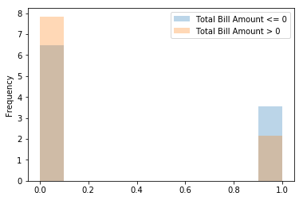


We found people with negative total bill amount are more likely to default.


```python
plt.scatter(df['TOT_PAY_AMT'], df['TOT_BILL_AMT'], s=2, alpha=0.5, c=list(map(get_color, df['default.payment.next.month'])))
plt.xlabel('Total Payment')
plt.ylabel('Total Bill')
plt.xticks(rotation=45)
```


    (array([-250000.,       0.,  250000.,  500000.,  750000., 1000000.,
            1250000., 1500000., 1750000., 2000000.]),
     <a list of 10 Text xticklabel objects>)


```python
plt.scatter(df['TOT_MOD'], df['TOT_BILL_AMT'], s=2, alpha=0.5, c=list(map(get_color, df['default.payment.next.month'])))
plt.xlabel('Total Month of Delays')
plt.ylabel('Total Bill')
```


    Text(0, 0.5, 'Total Bill')


The total month of delays is the sum of the `PAY` columns excluding the negative values. This new feature indicates people with high total month of delays are more likely to default.

# Trying classifiers
We will test out a broad suite of Machine Learning algorithms, as well as a few ensemble methods to find the best means of predicting defaulters.


```python
from sklearn.naive_bayes import GaussianNB 
from sklearn.model_selection import train_test_split

from sklearn import datasets
from sklearn.model_selection import train_test_split
import matplotlib
import matplotlib.pyplot as plt
import numpy as np
import seaborn as sn
import pandas as pd
import os
from sklearn.neighbors import KNeighborsClassifier as knn
from sklearn import svm
from sklearn.ensemble import RandomForestClassifier as rf
from sklearn.ensemble import  VotingClassifier,GradientBoostingClassifier, AdaBoostClassifier
from sklearn.pipeline import Pipeline
from sklearn.model_selection import GridSearchCV
from sklearn.linear_model import LogisticRegression, SGDRegressor,LinearRegression
from sklearn.svm import LinearSVC
from sklearn.metrics import confusion_matrix
from sklearn.tree import DecisionTreeRegressor
from sklearn.preprocessing import StandardScaler
from sklearn.neighbors import KNeighborsClassifier, KNeighborsRegressor
from sklearn.metrics import r2_score
from sklearn.linear_model import SGDClassifier
from sklearn.tree import DecisionTreeClassifier
```

    /home/ddong/anaconda3/envs/cst463/lib/python3.6/site-packages/sklearn/ensemble/weight_boosting.py:29: DeprecationWarning: numpy.core.umath_tests is an internal NumPy module and should not be imported. It will be removed in a future NumPy release.
      from numpy.core.umath_tests import inner1d


```python
pd.set_option('mode.chained_assignment', None)
df_train, df_test = train_test_split(df, test_size=0.3)
X_train = transformer.fit_transform(df_train)
y_train = df_train['default.payment.next.month']
X_test = transformer.transform(df_test)
y_test = df_test['default.payment.next.month']
```


```python
rand_frst = rf(n_estimators=100).fit(X_train, y_train)
transformer.feature_importances(rand_frst.feature_importances_).plot(kind='bar', x='feature')
```


    <matplotlib.axes._subplots.AxesSubplot at 0x7f4e086fdd68>


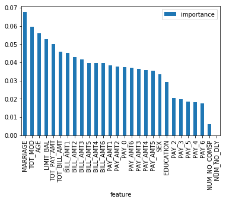


```python
transformer = Transformer(cat_features=[
    'SEX', 'MARRIAGE', 'PAY_0'
])
X_train = transformer.fit_transform(df_train)
y_train = df_train['default.payment.next.month']
X_test = transformer.transform(df_test)
y_test = df_test['default.payment.next.month']
```


```python
rand_frst = rf(n_estimators=100).fit(X_train, y_train)
transformer.feature_importances(rand_frst.feature_importances_).plot(kind='bar', x='feature')
```


    <matplotlib.axes._subplots.AxesSubplot at 0x7f4e086fd128>


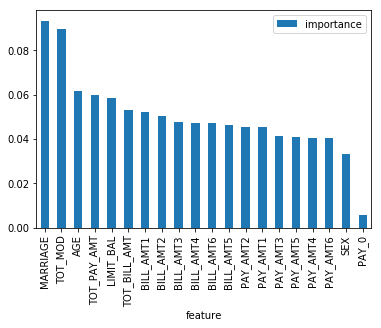


One of the derived feature `TOT_MOD` has high feature importance value according to a random forest classifier.
We remove the categorical variables with low feature importance value to reduce the dimensionality and improve the performance of the model.

### ML Specific Preprocessing


```python
from sklearn.model_selection import learning_curve


class ModelSelection:
    def __init__(self, X, y):
        self.X = X
        self.y = y

    def plot_learning_curves(self, estimators):
        for estimator, title in estimators:
            self._plot_learning_curve(estimator, title, self.X, self.y)
        plt.show()
        return plt

    @staticmethod
    def _plot_learning_curve(estimator, title, X, y, ylim=None, cv=None,
                             n_jobs=None, train_sizes=np.linspace(.1, 1.0, 8)):
        """
        Generate a simple plot of the test and training learning curve.
        http://scikit-learn.org/stable/auto_examples/model_selection/plot_learning_curve.html

        Parameters
        ----------
        estimator : object type that implements the "fit" and "predict" methods
            An object of that type which is cloned for each validation.

        title : string
            Title for the chart.

        X : array-like, shape (n_samples, n_features)
            Training vector, where n_samples is the number of samples and
            n_features is the number of features.

        y : array-like, shape (n_samples) or (n_samples, n_features), optional
            Target relative to X for classification or regression;
            None for unsupervised learning.

        ylim : tuple, shape (ymin, ymax), optional
            Defines minimum and maximum yvalues plotted.

        cv : int, cross-validation generator or an iterable, optional
            Determines the cross-validation splitting strategy.
            Possible inputs for cv are:
              - None, to use the default 3-fold cross-validation,
              - integer, to specify the number of folds.
              - An object to be used as a cross-validation generator.
              - An iterable yielding train/test splits.

            For integer/None inputs, if ``y`` is binary or multiclass,
            :class:`StratifiedKFold` used. If the estimator is not a classifier
            or if ``y`` is neither binary nor multiclass, :class:`KFold` is used.

            Refer :ref:`User Guide <cross_validation>` for the various
            cross-validators that can be used here.

        n_jobs : int or None, optional (default=None)
            Number of jobs to run in parallel.
            ``None`` means 1 unless in a :obj:`joblib.parallel_backend` context.
            ``-1`` means using all processors. See :term:`Glossary <n_jobs>`
            for more details.

        train_sizes : array-like, shape (n_ticks,), dtype float or int
            Relative or absolute numbers of training examples that will be used to
            generate the learning curve. If the dtype is float, it is regarded as a
            fraction of the maximum size of the training set (that is determined
            by the selected validation method), i.e. it has to be within (0, 1].
            Otherwise it is interpreted as absolute sizes of the training sets.
            Note that for classification the number of samples usually have to
            be big enough to contain at least one sample from each class.
            (default: np.linspace(0.1, 1.0, 5))
        """
        plt.figure()
        plt.title(title)
        if ylim is not None:
            plt.ylim(*ylim)
        plt.xlabel("Training examples")
        plt.ylabel("Score")
        train_sizes, train_scores, test_scores = learning_curve(
            estimator, X, y, cv=cv, n_jobs=n_jobs, train_sizes=train_sizes)
        train_scores_mean = np.mean(train_scores, axis=1)
        train_scores_std = np.std(train_scores, axis=1)
        test_scores_mean = np.mean(test_scores, axis=1)
        test_scores_std = np.std(test_scores, axis=1)
        plt.grid()

        plt.fill_between(train_sizes, train_scores_mean - train_scores_std,
                         train_scores_mean + train_scores_std, alpha=0.1,
                         color="r")
        plt.fill_between(train_sizes, test_scores_mean - test_scores_std,
                         test_scores_mean + test_scores_std, alpha=0.1, color="g")
        plt.plot(train_sizes, train_scores_mean, 'o-', color="r",
                 label="Training score")
        plt.plot(train_sizes, test_scores_mean, 'o-', color="g",
                 label="Cross-validation score")

        plt.legend(loc="best")
        return plt
```


```python
from sklearn.metrics import roc_curve, auc,roc_auc_score
#Y_SCORE is the decision_function
#y_score = classifier.score(X_test)
#y_test is the data frame of test values


def ROC_curve_plot(pred,y_test):
  fpr = dict()
  tpr = dict()
  roc_auc = dict()
  for i in range(2):
    fpr[i], tpr[i], _ = roc_curve(y_test, pred)
    roc_auc[i] = auc(fpr[i], tpr[i])

  print (roc_auc_score(y_test.ravel(), pred))
  plt.figure()
  plt.plot(fpr[1], tpr[1],color = 'darkorange')
  plt.plot([0,1],[0,1],color = 'navy',lw=2,linestyle='--')
  plt.xlim([0.0, 1.0])
  plt.ylim([0.0, 1.05])
  plt.xlabel('False Positive Rate')
  plt.ylabel('True Positive Rate')
  plt.title('Receiver operating characteristic')
  plt.show()
  
def confusion_matrix_plot_mine(y_test,predict,normalize=False):
  df_cm = pd.DataFrame(confusion_matrix(y_test,predict), index = [i for i in "01"],
                  columns = [i for i in "01"])
  print(df_cm.shape)
  total_sum = df_cm.sum().sum()
  if normalize:
        df_cm = df_cm.astype('float') / total_sum
  plt.figure(figsize = (10,7))
  sn.heatmap(df_cm, annot=True)
  plt.title('Heatmap of SGD Confusion Matrix')
  plt.ylabel("TRUE")
  plt.xlabel("PREDICTION")
```


```python
selector = ModelSelection(X_train, y_train)
```

## Gradient Boosting Classifier & GridSearch for best parameters

### <font color="red">Warning before running!: This is a very processor intensive piece of code. It can take a while to finish running. You may want to skip it and check some of the 'lighter' learning algorithms first.</font>


```python
gbrt = GradientBoostingClassifier()

n_estimators = np.arange(1,20)
depth = np.arange(1,10)
learning_rates = [0.01,0.1,1]

param_grid = {'n_estimators': n_estimators , 'max_depth' : depth, 'learning_rate':learning_rates}
grid1 = GridSearchCV(gbrt, param_grid=param_grid, cv=5, n_jobs=12)
grid1.fit(X_train,y_train.ravel())
```


    GridSearchCV(cv=5, error_score='raise',
           estimator=GradientBoostingClassifier(criterion='friedman_mse', init=None,
                  learning_rate=0.1, loss='deviance', max_depth=3,
                  max_features=None, max_leaf_nodes=None,
                  min_impurity_decrease=0.0, min_impurity_split=None,
                  min_samples_leaf=1, min_samples_split=2,
                  min_weight_fraction_leaf=0.0, n_estimators=100,
                  presort='auto', random_state=None, subsample=1.0, verbose=0,
                  warm_start=False),
           fit_params=None, iid=True, n_jobs=12,
           param_grid={'n_estimators': array([ 1,  2,  3,  4,  5,  6,  7,  8,  9, 10, 11, 12, 13, 14, 15, 16, 17,
           18, 19]), 'max_depth': array([1, 2, 3, 4, 5, 6, 7, 8, 9]), 'learning_rate': [0.01, 0.1, 1]},
           pre_dispatch='2*n_jobs', refit=True, return_train_score='warn',
           scoring=None, verbose=0)


```python
print("Best Accuracy: ",grid1.best_score_*100)
print("Best params: ", grid1.best_params_)
```

    Best Accuracy:  82.05142857142857
    Best params:  {'learning_rate': 0.1, 'max_depth': 4, 'n_estimators': 18}


Accuracy of about 82% seems pretty decent! This will end up being one of our best classifiers


```python
gbrt_best = GradientBoostingClassifier(learning_rate=0.1, max_depth=4, n_estimators=18)
gbrt_best.fit(X_train,y_train)
predict = gbrt_best.predict(X_test)

print(gbrt_best.score(X_test,y_test))
confusion_matrix_plot_mine(y_test,predict,normalize=True)
```

    0.8145333333333333
    (2, 2)


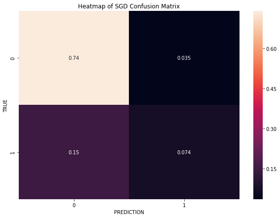


```python
y_score = gbrt_best.predict(X_test)
ROC_curve_plot(y_test,y_score)
```

    0.7555555007283791


```python
selector.plot_learning_curves([
    (gbrt_best, 'Gradient Boosting ({})'.format(grid1.best_params_))
])
```


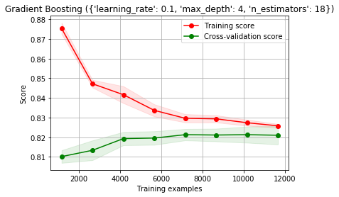


    <module 'matplotlib.pyplot' from '/home/ddong/anaconda3/envs/cst463/lib/python3.6/site-packages/matplotlib/pyplot.py'>


## Stochastic Gradient Desecent and Grid Search
### <font color = "red">Also very processor heavy</font>


```python
SGDC = SGDClassifier(max_iter=1000)
#n_estimators = np.arange(1,20)
depth = np.arange(1,10)
alpha = [0.001,0.0001,0.01,0.1,1]
loss = ["hinge","modified_huber","log"]
penalty = ["l2","l1","elasticnet"]

param_grid = {'alpha': alpha , 'loss' : loss, 'penalty':penalty}

grid2 = GridSearchCV(SGDC, param_grid=param_grid, cv=5, n_jobs=4)
grid2.fit(X_train,y_train.ravel())
```


    GridSearchCV(cv=5, error_score='raise',
           estimator=SGDClassifier(alpha=0.0001, average=False, class_weight=None, epsilon=0.1,
           eta0=0.0, fit_intercept=True, l1_ratio=0.15,
           learning_rate='optimal', loss='hinge', max_iter=1000, n_iter=None,
           n_jobs=1, penalty='l2', power_t=0.5, random_state=None,
           shuffle=True, tol=None, verbose=0, warm_start=False),
           fit_params=None, iid=True, n_jobs=4,
           param_grid={'alpha': [0.001, 0.0001, 0.01, 0.1, 1], 'loss': ['hinge', 'modified_huber', 'log'], 'penalty': ['l2', 'l1', 'elasticnet']},
           pre_dispatch='2*n_jobs', refit=True, return_train_score='warn',
           scoring=None, verbose=0)


```python
print("Best Accuracy: ",grid2.best_score_*100)
print("Best params: ", grid2.best_params_)
```

    Best Accuracy:  82.13142857142857
    Best params:  {'alpha': 0.1, 'loss': 'modified_huber', 'penalty': 'l2'}


Accuracy here of about 82%.


```python
SGDC_best = SGDClassifier(alpha=0.1, loss='modified_huber', penalty='l2')
SGDC_best.fit(X_train,y_train)
predict = SGDC_best.predict(X_test)

print(SGDC_best.score(X_test,y_test))
confusion_matrix_plot_mine(y_test,predict,normalize=True)
```

    0.8134666666666667
    (2, 2)


```python
y_score = SGDC_best.predict(X_test)
ROC_curve_plot(y_test,y_score)
```

    0.7474048105685865


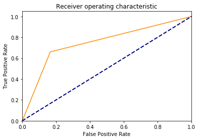


```python
selector.plot_learning_curves([
    (SGDC_best, 'Stochastic Gradient Descent ({})'.format(grid2.best_params_))
])
```


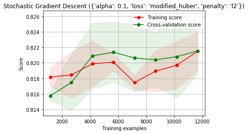


    <module 'matplotlib.pyplot' from '/home/ddong/anaconda3/envs/cst463/lib/python3.6/site-packages/matplotlib/pyplot.py'>


## Support Vector Machine


```python
SGDC = svm.SVC()
kernel = ['linear','rbf','sigmoid']
cvalues = [0.001,0.0001,0.01,0.1,1]

param_grid = {'kernel': kernel , 'C': cvalues}

grid3 = GridSearchCV(SGDC, param_grid=param_grid, cv=5, n_jobs=4)
grid3.fit(X_train, y_train.ravel())
```


    GridSearchCV(cv=5, error_score='raise',
           estimator=SVC(C=1.0, cache_size=200, class_weight=None, coef0=0.0,
      decision_function_shape='ovr', degree=3, gamma='auto', kernel='rbf',
      max_iter=-1, probability=False, random_state=None, shrinking=True,
      tol=0.001, verbose=False),
           fit_params=None, iid=True, n_jobs=4,
           param_grid={'kernel': ['linear', 'rbf', 'sigmoid'], 'C': [0.001, 0.0001, 0.01, 0.1, 1]},
           pre_dispatch='2*n_jobs', refit=True, return_train_score='warn',
           scoring=None, verbose=0)


```python
print("Best Accuracy: ",grid3.best_score_*100)
print("Best params: ", grid3.best_params_)
```

    Best Accuracy:  82.01714285714286
    Best params:  {'C': 1, 'kernel': 'rbf'}


```python
svc_best = svm.SVC(C=1, kernel='rbf')
svc_best.fit(X_train,y_train.ravel())

predict = svc_best.predict(X_test)

print(svc_best.score(X_test,y_test))
confusion_matrix_plot_mine(y_test,predict,normalize=True)
```

    0.8134666666666667
    (2, 2)


```python
y_score = svc_best.predict(X_test)
ROC_curve_plot(y_test,y_score)
```

    0.7523255022131425


```python
selector.plot_learning_curves([
    (svc_best, 'SVC ({})'.format(grid3.best_params_))
])
```


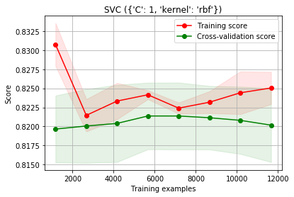


    <module 'matplotlib.pyplot' from '/home/ddong/anaconda3/envs/cst463/lib/python3.6/site-packages/matplotlib/pyplot.py'>


## K-Nearest Neighbors


```python
KNN =KNeighborsClassifier()
n = np.arange(1, 11, 2)
param_grid = {'n_neighbors': n}

grid4 = GridSearchCV(KNN, param_grid=param_grid, cv=5, n_jobs=4)
grid4.fit(X_train,y_train.ravel())
```


    GridSearchCV(cv=5, error_score='raise',
           estimator=KNeighborsClassifier(algorithm='auto', leaf_size=30, metric='minkowski',
               metric_params=None, n_jobs=1, n_neighbors=5, p=2,
               weights='uniform'),
           fit_params=None, iid=True, n_jobs=4,
           param_grid={'n_neighbors': array([1, 3, 5, 7, 9])},
           pre_dispatch='2*n_jobs', refit=True, return_train_score='warn',
           scoring=None, verbose=0)


```python
print("Best Accuracy: ",grid4.best_score_ * 100)
print("Best params: ", grid4.best_params_)
```

    Best Accuracy:  81.18285714285715
    Best params:  {'n_neighbors': 9}


```python
knn_best = KNeighborsClassifier(n_neighbors=9)
knn_best.fit(X_train,y_train.ravel())

predict = knn_best.predict(X_test)

print(knn_best.score(X_test, y_test))
confusion_matrix_plot_mine(y_test, predict,normalize=True)
```

    0.808
    (2, 2)


```python
y_score = knn_best.predict(X_test)
ROC_curve_plot(y_test,y_score)
```

    0.7290441176470588


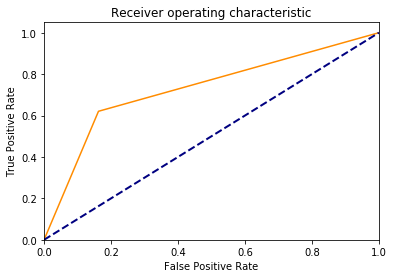


```python
selector.plot_learning_curves([
    (knn_best, 'KNN {}'.format(grid4.best_params_))
])
```


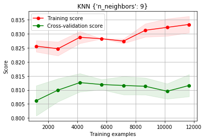


    <module 'matplotlib.pyplot' from '/home/ddong/anaconda3/envs/cst463/lib/python3.6/site-packages/matplotlib/pyplot.py'>


## Decision Tree


```python
tree =DecisionTreeClassifier()
max_depth = np.arange(1,20)
param_grid = {'max_depth': max_depth}

grid5 = GridSearchCV(tree, param_grid=param_grid, cv=5, n_jobs=8)
grid5.fit(X_train,y_train.ravel())
```


    GridSearchCV(cv=5, error_score='raise',
           estimator=DecisionTreeClassifier(class_weight=None, criterion='gini', max_depth=None,
                max_features=None, max_leaf_nodes=None,
                min_impurity_decrease=0.0, min_impurity_split=None,
                min_samples_leaf=1, min_samples_split=2,
                min_weight_fraction_leaf=0.0, presort=False, random_state=None,
                splitter='best'),
           fit_params=None, iid=True, n_jobs=8,
           param_grid={'max_depth': array([ 1,  2,  3,  4,  5,  6,  7,  8,  9, 10, 11, 12, 13, 14, 15, 16, 17,
           18, 19])},
           pre_dispatch='2*n_jobs', refit=True, return_train_score='warn',
           scoring=None, verbose=0)


```python
print("Best Accuracy: ",grid5.best_score_ * 100)
print("Best params: ", grid5.best_params_)
```

    Best Accuracy:  81.88
    Best params:  {'max_depth': 4}


Almost 82% accuracy! This is nearly the best we've gotten so far. Seems like the big trade-off in training will be computational/time complexity vs. prediciton accuracy. 


```python
tree_best = DecisionTreeClassifier(max_depth=4)
tree_best.fit(X_train,y_train.ravel())

predict = tree_best.predict(X_test)

print(tree_best.score(X_test,y_test))
confusion_matrix_plot_mine(y_test,predict,normalize=True)
```

    0.8126666666666666
    (2, 2)


```python
y_score = tree_best.predict(X_test)
ROC_curve_plot(y_test,y_score)
```

    0.756070310113382


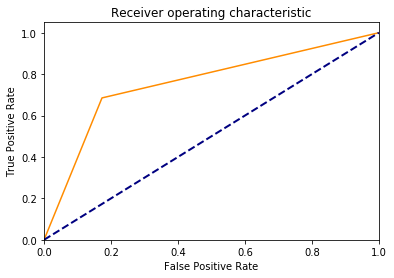


```python
selector.plot_learning_curves([
    (tree_best, 'DecisionTree ({})'.format(grid5.best_params_))
])
```


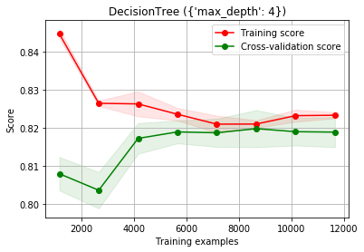


    <module 'matplotlib.pyplot' from '/home/ddong/anaconda3/envs/cst463/lib/python3.6/site-packages/matplotlib/pyplot.py'>


## ADA-Boost


```python
ada = AdaBoostClassifier()
learning_rate = [0.001,0.0001,0.01,0.1,1]
n_estimators = np.arange(1,100,10)
param_grid = {'learning_rate': learning_rate,'n_estimators': n_estimators}

grid6 = GridSearchCV(ada, param_grid=param_grid, cv=5, n_jobs=8)
grid6.fit(X_train, y_train.ravel())
```


    GridSearchCV(cv=5, error_score='raise',
           estimator=AdaBoostClassifier(algorithm='SAMME.R', base_estimator=None,
              learning_rate=1.0, n_estimators=50, random_state=None),
           fit_params=None, iid=True, n_jobs=8,
           param_grid={'learning_rate': [0.001, 0.0001, 0.01, 0.1, 1], 'n_estimators': array([ 1, 11, 21, 31, 41, 51, 61, 71, 81, 91])},
           pre_dispatch='2*n_jobs', refit=True, return_train_score='warn',
           scoring=None, verbose=0)


```python
print("Best Accuracy: ",grid6.best_score_ * 100)
print("Best params: ", grid6.best_params_)
```

    Best Accuracy:  81.97714285714287
    Best params:  {'learning_rate': 1, 'n_estimators': 51}


```python
ada_best = AdaBoostClassifier(learning_rate=1, n_estimators=51)
ada_best.fit(X_train,y_train.ravel())

predict = ada_best.predict(X_test)

print(ada_best.score(X_test,y_test))
confusion_matrix_plot_mine(y_test,predict,normalize=True)
```

    0.8121333333333334
    (2, 2)


```python
y_score = ada_best.predict(X_test)
ROC_curve_plot(y_test,y_score)
```

    0.742691435875924


```python
selector.plot_learning_curves([
    (ada_best, 'AdaBoost ({})'.format(grid6.best_params_))
])
```


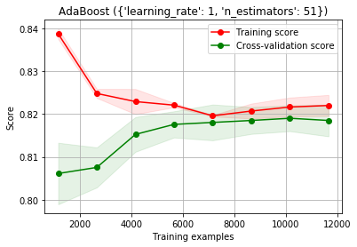


    <module 'matplotlib.pyplot' from '/home/ddong/anaconda3/envs/cst463/lib/python3.6/site-packages/matplotlib/pyplot.py'>


# Conclusion
Our best prediction accuracy was around 82-83%, our lowest measured prediction accuracy was about 80%. This is not a particularly large spread, especially considering the disparity in the time it takes for some models to train with the Grid Search to find the best hyper-parameters.
Two things we'd like to persue in the next week that can help refine the power of our predictions would be: 
1. A comparison of the time required to train models vs. their predictive power.
2. Possibly pursuing some solutions that increase the cost function to mitigate the high occurance of false negatives that we've seen in most of our predictions. It is in the lending body's interest to extend credit to the absolute fewest amount of people that might default on that credit. As it stands, we would be granting too much credit to people that end up not paying back their loans. 
